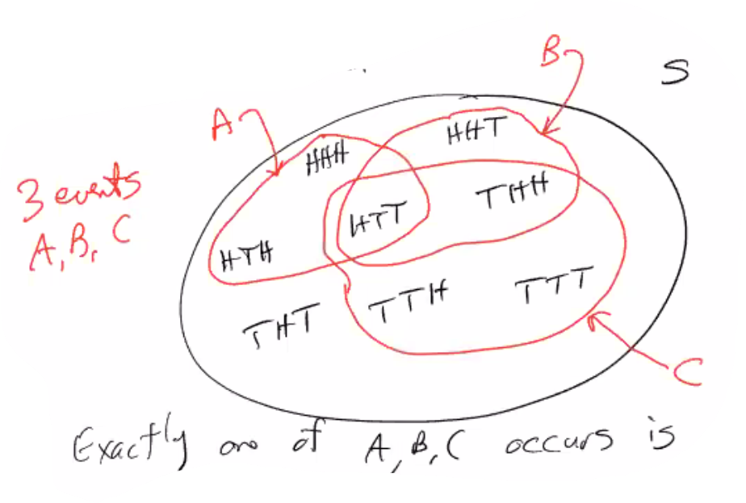

# Lecture 1 (Tue 10/03/2023)

Owner: Philip Manfred Pincencia

## Boolean Logic

- $(E^C)^C=E$

## Example:

### Flip 3 coins:

There are $3^2$ outcomes. 

$=\{HHH, HHT, TTH, TTT\}$

<aside>
💡 Outcome is a triple, not a single flip $H/T$.

</aside>

**Def: Probability is an assignment of a number to an event

For each event $E\subseteq S$, $P(E)\in \mathbb{R}$, Probability must satisfy 3 axioms:

1. $0\leq P(E)\leq 1$
2. $P(S)=1$
3. If $E_1,E_2,E_3,…$ are pairwise disjoint, then** $P(E_1\cup E_2\cup ...)=P(E_1)+P(E_2)+…$. 
****

If $E,F$ are not disjoint, then we cannot say Axiom 3. We have to use Principle of Inclusion-Exclusion (CSE 21)

Fact: $P(A^C)=1-P(A)$

- Proof
    
    

Example: 

Given events $A,B$ such that 

- $P(AB)=0.4$
- $P(AB^C)=0.1$
- $P(A\cup B)=0.6$

Find everything else:

$P(A^CB)=P(A\cup B)-P(AB)-P(AB^C)=0.1$

Using DeMorgan’s Law, $P((A\cup B)^C)=A^CB^C=1-0.6$

Fact: $P(\emptyset)=0$

- Proof
    
    We know $\emptyset=S^C$. So, $P(\emptyset)=P(S^C)=1-P(S)=1-1=0$
    

Fact: If $E\subseteq F$, then $P(E)\leq P(F)$.

- Proof
    
    $F=E\cup E^C F$. This is a disjoint union, so $P(F)=P(E\cup E^CF)=P(E)+P(E^CF)\geq P(E)$. 
    

Consequence: 

Note that $AB\subseteq A$ and $AB\subseteq B$. Thus, $P(AB)\leq P(A)$ and $P(AB)\leq P(B)$.

Special Case - Sometimes every outcome of the sample space has the same probability. We call this “equiprobable outcomes”. This mean for any event $E$, $P(E)=\frac{|E|}{|S|}$. assumes $S$ is finite. 

Example: 

Pick card randomly from a standard deck. $|S|=52$. 

Let $E=$”the card is red”, $|E|=26$. So, $P(E)=\frac{26}{52}=\frac{1}{2}$. 

Let $F=$”the card is an Ace”, $|F|=4$. So, $P(F)=\frac{|F|}{|S|}=\frac{1}{13}$

### Permutations & Combinations

Permutations are orderings of a set. Set $\{1,2,…,n\}$ has $n!$ different orderings. 

Combinations: $\binom{n}{k}$= n choose k= the number of subsets of size $k$ from a set of size $n$. 

Example: How many triples of letters can we pick from $A,B,C,D,E$?

Answer: $\binom{5}{3}$. 

> Set is unordered. So, $\{B,A,C\}=\{A,C,B\}$.
> 

Binomial Theorem

$$
(x+y)^n=\sum_{k=0}^n \binom{n}{k} x^k y^{n-k}
$$